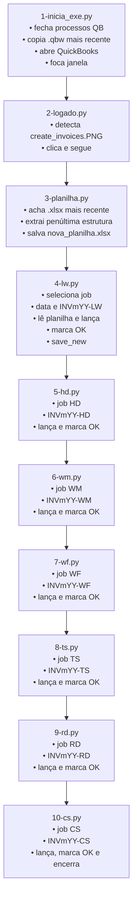

# 🤖 Robô de Automação QuickBooks

Automação em **Python** para lançar pedidos e invoices no QuickBooks por visão computacional (OpenCV) e automação de interface (PyAutoGUI), com orquestração entre scripts e processamento de planilhas (OpenPyXL).

---

## 🔧 Stack
- Python 3.8+
- PyAutoGUI • OpenCV • NumPy • OpenPyXL • python-dateutil • pyperclip • logging
- Sistema operacional: Windows (uso de `taskkill`, `os.startfile`, e interação com janelas)
- Requisitos visuais: resolução/escala consistentes, templates na pasta `img/`

Instale as dependências:
```bash
pip install pyautogui opencv-python numpy openpyxl python-dateutil pyperclip
```

---

## 🗂️ Estrutura (alto nível)
```
1-inicia_exe.py   # prepara ambiente, copia .qbw e abre o QuickBooks
2-logado.py       # detecta "Create Invoices" e avança
3-planilha.py     # extrai estrutura da planilha mais recente e gera nova planilha de trabalho
4-lw.py           # processa colunas LW (quant./valor) e marca OK
5-hd.py           # processa colunas HD (quant./valor) e marca OK
6-wm.py           # processa colunas WM (quant./valor) e marca OK
7-wf.py           # processa colunas WF (quant./valor) e marca OK
8-ts.py           # processa colunas TS (quant./valor) e marca OK
9-rd.py           # processa colunas RD (quant./valor) e marca OK
10-cs.py          # processa colunas CS (quant./valor) e encerra fluxo
logger_config.py  # configuração de logs centralizada
img/              # templates de tela (PNG) para matching
```

> Observação: caso o arquivo apareça nomeado como `10-cd.py` no repositório, trata-se do módulo de **CS**.

---

## 🔁 Fluxo (Mermaid)


---

## ▶️ Execução
1) Garanta que:
   - QuickBooks esteja acessível na máquina.
   - A pasta `img/` contenha os templates de tela atualizados.
   - A planilha mais recente esteja na pasta configurada (rede/local).
   - A escala/resolução do Windows esteja estável (não mexer no mouse/teclado durante a execução).

2) Rode o pipeline completo:
```bash
python 1-inicia_exe.py
```

Os scripts seguintes serão chamados automaticamente (encadeados).

---

## ⚙️ Parâmetros e caminhos importantes
- **Pasta de templates**: `IMAGES_PATH = "img"` (em todos os módulos)
- **Planilhas**:
  - Origem (rede): configurada em `3-planilha.py` (ex.: `\\...\\Robo Quickboks`)
  - Saída de trabalho: `C:\Users\...\base_robo_quickboks\nova_planilha.xlsx`
- **Reconhecimento de imagem**:
  - `threshold` padrão: `0.8`
  - `timeout` padrão: `300s`

---

## 🧪 Desenvolvimento e troubleshooting
- Execute módulos individualmente para testes, por exemplo:
  ```bash
  python 3-planilha.py
  python 4-lw.py
  ```
- Ajuste templates em `img/` quando botões/campos mudarem.
- Verifique logs para entender paradas de fluxo (tempo de espera, matching insuficiente, etc.).
- Se a escala do Windows mudar (DPI), atualize os templates ou normalize a escala.

---

## ✅ Convenções usadas
- Número do invoice: `INVmYY-<SIGLA>` (ex.: `INV8-25-LW`).
- Marcação de linhas concluídas na planilha: célula da coluna de status recebe `"OK"`.
- Sequência automática via `subprocess.run()` entre módulos.

---

## 🛡️ Dicas de robustez
- Mantenha todos os PNGs com **alto contraste** e recortes precisos da região clicável.
- Utilize `logger` para instrumentar pontos que costumam falhar (aparição de modais, timeouts).
- Se necessário, reduza `threshold` para 0.75–0.78 em telas com compressão, mas avalie falsos positivos.
- Considere adicionar verificação dupla: *template matching* + texto quando possível.

---

## 📄 Licença
Defina sua licença (MIT, Apache-2.0, etc.) conforme sua necessidade.
